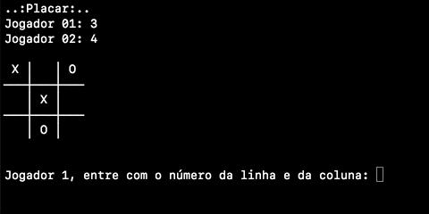

# Programação Orientada a Objetos - POO29004

## Engenharia de Telecomunicações

### Instituto Federal de Santa Catarina


#### Notas

> 1. Crie um arquivo `.gitignore` e faça *commit* do mesmo
> 1. Crie uma classe `Principal.java` dentro do pacote `poo` e faça *commit* com todos os arquivos do projeto
> 1. Faça comentários seguindo o formato do JavaDOC
> 1. Crie classes para teste de unidade (JUnit) e teste todos os métodos essenciais e faça um *commit* com os testes 
> 1. Tenha certeza que seu código passe por todos os testes e que possa ser executado sem problemas

#### Passos para desenvolvimento

> 1. O projeto deve ser desenvolvido em grupo com duas ou uma pessoa
> 2. Reserve os 10 minutos iniciais para pensar na organização de como atacará o problema
> 3. Determine como os componentes da dupla irão trabalhar
>    1. **Programação em dupla em um único computador**, da [*Extreme Programming* (XP)](https://pt.wikipedia.org/wiki/Programa%C3%A7%C3%A3o_extrema).  Um aluno codifica e outro aluno ajuda. Dessa forma, o código sempre é revisto por duas pesssoas, podendo assim diminuir a possibilidade de defeitos.
>    2. **Cada aluno com seu próprio computador**. Um aluno clona o repositório com o código inicial fornecido pelo professor, cria um projeto com IntelliJ, cria o .gitignore, faz os *commits* iniciais e faz um *push* do projeto para o repositório remoto. O outro aluno clona o repositório remoto em sua máquina local. Cada aluno fica responsável por criar uma classe de testes e é feita uma distrubuição dos testes, bem como da  implementação da lógica do jogo, que serão realizados por cada aluno. O uso de branchs é altamente recomendado.

## Jogo da velha


O jogo poderá ser jogado por 2 jogadores humanos ou por 1 jogador com 1 jogador lógico (computador). Ao iniciar o programa deve-se solicitar ao usuário qual modalidade ele gostaria (1 ou 2 jogadores humanos). O jogo deverá ter um placar e no final de cada partida deve-se incrementar a pontuação daquele jogador que ganhou e solicitar ao usuário se ele deseja iniciar uma nova partida ou se deseja finalizar o programa. O jogador que inicia uma partida deve ser alternado. Por exemplo, se jogador X iniciou a partida 1, então o jogador O deverá iniciar a partida 2.




Projete de forma que cada ação de validação do jogo (i.e. `boolean ganhou()`, `boolean tabuleiroCheio()`) esteja um método separado e que possa ser testado automaticamente.


> **Desafio:** Faça uma inteligência para o jogador 'computador' de forma que ele sempre tente ganhar o jogo e não simplesmente jogue em uma casa qualquer.


### Material de apoio

Criando uma matriz de caracteres. [De acordo com a documentação oficial](https://docs.oracle.com/javase/tutorial/java/nutsandbolts/datatypes.html), em Java o tipo primitivo `char` armazena um único caractere 16-bit Unicode.  Se uma variável declarada como `char` não for inicializada explicitamente, essa fica com o valor padrão `\u0000`.

```java
// Definindo estaticamente valores ao criar matriz
char[][] tab = {{'X',' ',' '},{' ','X',' '},{' ',' ','X'}};

// Criando matriz de caracteres 
char[][] tab = new char[3][3];
tab[0][0] = ' '; // atribuindo 'espaço' na linha 0 e coluna 0

// Exemplos para matriz com inteiros
int[][] tab2 = new int[][]{{0,0,0},{0,1,0},{0,0,0}};
int[][] tab3 = {{1,-1,0},{0,1,0},{0,0,0}};
int[][] tab4 = new int[3][3];
tab4[0][0] = 1;
```


[Caracteres em UTF-8](https://www.utf8-chartable.de/unicode-utf8-table.pl?start=9472&unicodeinhtml=dec) que podem ser usados para imprimir o Jogo da Velha.

```java
│ \u2502 
─ \u250 
┼ \u253c

System.out.println("   \u2502   \u2502   ");
System.out.println("\u2500\u2500\u2500\u253c\u2500\u2500\u2500\u253c\u2500\u2500\u2500");
System.out.println("   \u2502   \u2502   ");
System.out.println("\u2500\u2500\u2500\u253c\u2500\u2500\u2500\u253c\u2500\u2500\u2500");
System.out.println("   \u2502   \u2502   ");

```


É possível ler dois inteiros sem a necessidade de pressionar ENTER entre eles.

```java
Scanner teclado = new Scanner(System.in);
System.out.print("Entre com o número da linha e da coluna: ");
int linha = teclado.nextInt();
int coluna = teclado.nextInt();
System.out.println("l: " + linha + ", c: " + coluna);
```

```shell
Entre com o número da linha e da coluna: 1 2 ⏎
l: 1, c: 2
```


Uma forma de limpar a tela

```java
/**
 * Uma maneira de limpar o console em terminais Unix
 *
 * Esse código não funcionará, por exemplo, quando se executa o programa
 * dentro do IntelliJ ou mesmo no prompt do Windows
 */
public void limparTelaTerminalVT100(){
	System.out.print("\033[H\033[2J");
	System.out.flush();
}
```

